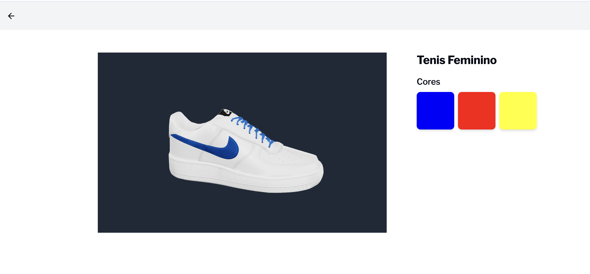

# Desafio Desenvolvedor Full Stack - Futuriza

## Introdução

Bem-vindo ao desafio de desenvolvedor full stack da Futuriza! Este desafio tem como objetivo avaliar suas habilidades em desenvolvimento front-end e back-end utilizando Next.js. O projeto base está nesse repo repositório [futuriza/desafio-dev-fullstack](https://github.com/futuriza/desafio-dev-fullstack).

## Desafio

Seu objetivo é montar o layout de acordo com a image acima e implementar as seguintes funcionalidades:

1. **Layout**
    - Montar o layout de acordo com a imagem acima, a funcionalidade, aqui nessa URL também temos a funcionalidade [https://calcados.futuriza.io/product/tenis-feminino](https://calcados.futuriza.io/product/tenis-feminino)
    - Utilizar [shadcn/ui](https://ui.shadcn.com/) e Tailwind CSS

2. **Serviço NextJS**
    - Criar um serviço usando NextJS que chama o endpoint (https://raw.githubusercontent.com/futuriza/desafio-product-data/main/data/product.json) para obter as informações  do produto  e encapsula em um objeto.
    - Exibir as informações do produto na view

3. **Modelo 3D**
    - Com base no objeto retornado pelo serviço, exibir o modelo 3D do produto usando a biblioteca [modelviewer.dev](https://modelviewer.dev/)
    - Montar a lista de cores de acordo com as cores do produto retornado
    - Ao selecionar uma cor, deve mudar o modelo 3D (busque pela `variant` no `modelviewer`)

4. **Deploy**
    - Publicar o projeto numa conta free da [Vercel](https://vercel.com/) ou equivalente
    - Enviar o link do projeto no seu GitHub e a URL do projeto publicado

## Requisitos

- Next.js
- shadcn/ui
- Tailwind CSS
- modelviewer.dev

## Instruções

1. Faça um fork do projeto [futuriza/desafio-dev-fullstack](https://github.com/futuriza/desafio-dev-fullstack)
2. Implemente as funcionalidades descritas no desafio
3. Publique o projeto na Vercel ou em um serviço equivalente
4. Envie o link do seu repositório GitHub e a URL do projeto publicado

## Prazo

Você terá um prazo de **3 dias** para concluir o desafio a partir do momento que receber as instruções.

## Boa sorte!

Desejamos boa sorte e um bom desafio a todos os participantes! Se tiverem qualquer dúvida, fiquem à vontade para entrar em contato.

---
